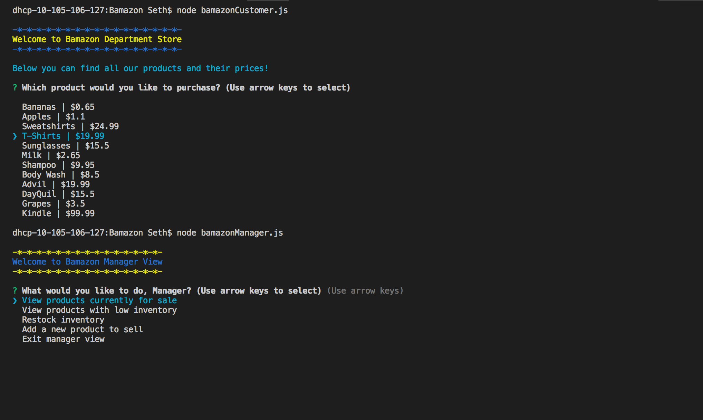
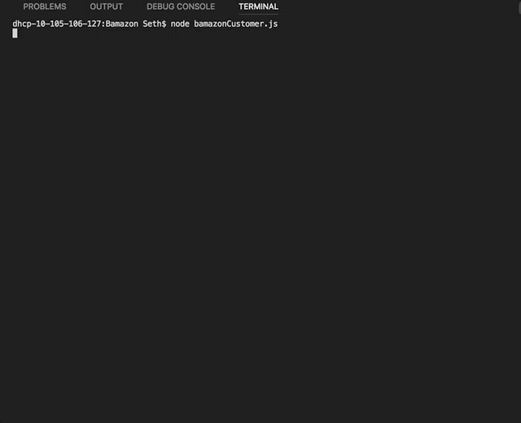
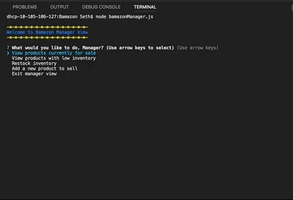

# Bamazon Department Store App

### Description 

This is an interactive command line department store app with two sections. 

### How it Works
The Customer View allows the user to see a list of products and their prices, select a product and make a purchase. The Manager View gives the user a menu of managerial options such as viewing items with low inventory, restocking those items, as well as an option to add new products to sell.

### Links
##### Github Repo:  https://github.com/sefeder/Bamazon

##### Demo Video:  https://drive.google.com/file/d/1A8-zsDnOZBItw01hVTZCgbN2LbF1wHnN/view?usp=sharing

###Customer View

###Manager View

###Technology Used
JavaScript,
node.JS,
npm,
MySQL

### Future Versions
In future versions of the app, I would like to add a Supervisor View that can log the profit coming from each different department and other things like that.

